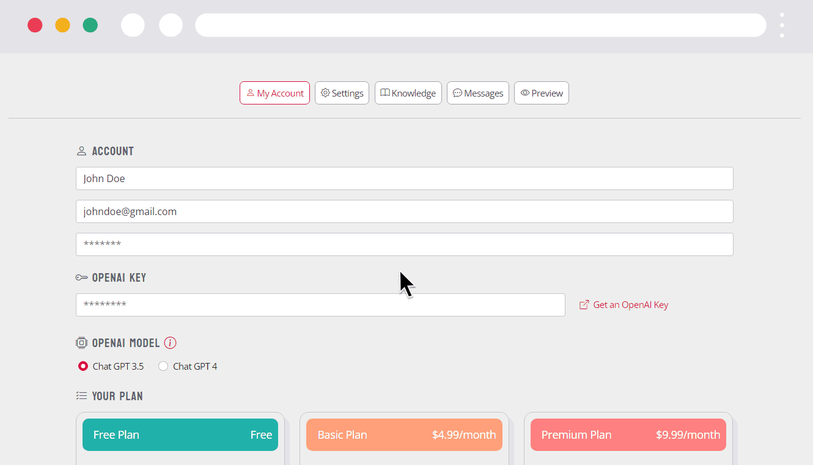

# 🤖 BotPal.io - AI-Powered Customer Support Chatbot Platform

<p align="center">
  
</p>

<p align="center">
  <strong>Create your own personalized AI chatbot for customer support in minutes.</strong>
</p>

<p align="center">
  <a href="#features">Features</a> •
  <a href="#demo">Demo</a> •
  <a href="#installation">Installation</a> •
  <a href="#configuration">Configuration</a> •
  <a href="#deployment">Deployment</a> •
  <a href="#license">License</a>
</p>

---

## ✨ Features

- **🎭 Customizable Characters** - Choose from 12 preset avatars or upload your own custom character
- **🎨 Full Visual Customization** - Colors, fonts, sizes, and chat widget placement
- **📚 Multiple Knowledge Sources** - Train your bot using FAQ, plain text, or PDF documents
- **🔌 Easy Integration** - Simple embed code for any website
- **💬 Conversation Management** - View, analyze, and manage all chat interactions
- **💳 Subscription System** - Built-in Stripe integration with multiple pricing tiers
- **🤖 OpenAI Integration** - Powered by GPT-4o-mini and GPT-4o

## 🖥️ Demo



## 🛠️ Tech Stack

- **Backend:** Laravel 10 (PHP 8.1+)
- **Frontend:** Blade Templates, Bootstrap 5, Tailwind CSS
- **Database:** MySQL 8.0
- **AI:** OpenAI GPT API
- **Payments:** Stripe (via Laravel Cashier)
- **Email:** SendGrid
- **Queue:** Redis (recommended) or Database

## 📋 Requirements

- PHP 8.1 or higher
- Composer 2.x
- Node.js 18+ & NPM
- MySQL 8.0+
- Redis (optional, for queues)

## 🚀 Installation

### 1. Clone the repository

```bash
git clone https://github.com/rdegregorio/botpal.git
cd botpal
```

### 2. Install PHP dependencies

```bash
composer install
```

### 3. Install Node.js dependencies

```bash
npm install
```

### 4. Environment setup

```bash
cp .env.example .env
php artisan key:generate
```

### 5. Configure your `.env` file

Edit `.env` with your database credentials, Stripe keys, SendGrid API key, etc.

### 6. Run migrations

```bash
php artisan migrate
```

### 7. Build assets

```bash
npm run build
```

### 8. Create storage link

```bash
php artisan storage:link
```

### 9. Start the development server

```bash
php artisan serve
```

Visit `http://localhost:8000` to see your application.

## ⚙️ Configuration

### Required Environment Variables

| Variable | Description |
|----------|-------------|
| `APP_URL` | Your application URL |
| `DB_*` | Database connection details |
| `STRIPE_KEY` | Stripe publishable key |
| `STRIPE_SECRET` | Stripe secret key |
| `MAIL_*` | Email configuration (SendGrid recommended) |

### Optional Configuration

| Variable | Description |
|----------|-------------|
| `NOCAPTCHA_SITEKEY` | Google reCAPTCHA site key |
| `NOCAPTCHA_SECRET` | Google reCAPTCHA secret |
| `QUEUE_CONNECTION` | Queue driver (redis recommended) |

## 🌐 Deployment

### Production Checklist

```bash
# Optimize for production
composer install --optimize-autoloader --no-dev
npm run build
php artisan config:cache
php artisan route:cache
php artisan view:cache

# Set proper permissions
chmod -R 775 storage bootstrap/cache
```

### Recommended Hosting

- **VPS:** DigitalOcean, Linode, Vultr
- **PaaS:** Laravel Forge, Railway, Render
- **Serverless:** Laravel Vapor (AWS)

## 📖 How It Works

1. **Sign Up** - Users create an account
2. **Choose a Plan** - Free, Basic, Premium, or Business
3. **Configure Bot** - Select character, customize appearance
4. **Add Knowledge** - Train the bot with FAQ, text, or PDFs
5. **Get Embed Code** - Copy the script tag
6. **Deploy** - Paste the code on any website
7. **Monitor** - View conversations in the dashboard

## 🔧 API Endpoints

| Endpoint | Method | Description |
|----------|--------|-------------|
| `/api/embed/{uuid}` | GET | Get embeddable widget JS |
| `/api/chat/request` | POST | Send a message to the bot |
| `/api/chat/result` | GET | Get bot response |

## 📊 Subscription Plans

| Plan | Features |
|------|----------|
| **Free** | FAQ-based knowledge only, 1 character |
| **Basic** | Plain text knowledge, all characters |
| **Premium** | PDF upload, custom characters |
| **Business** | Unlimited everything, priority support |

## 🤝 Contributing

Contributions are welcome! Please feel free to submit a Pull Request.

1. Fork the repository
2. Create your feature branch (`git checkout -b feature/amazing-feature`)
3. Commit your changes (`git commit -m 'Add amazing feature'`)
4. Push to the branch (`git push origin feature/amazing-feature`)
5. Open a Pull Request

## 📝 License

This project is licensed under the MIT License - see the [LICENSE](LICENSE) file for details.

## 🙏 Acknowledgments

- [Laravel](https://laravel.com) - The PHP Framework
- [OpenAI](https://openai.com) - AI Models
- [Stripe](https://stripe.com) - Payment Processing
- [Bootstrap](https://getbootstrap.com) - UI Framework

---

<p align="center">
  Made with ❤️
</p>
